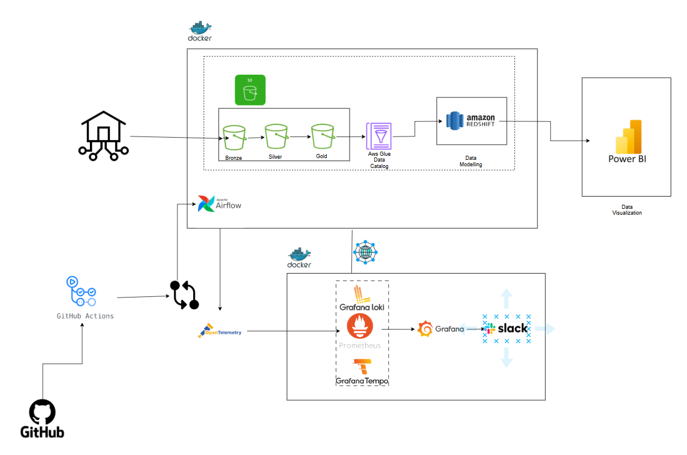
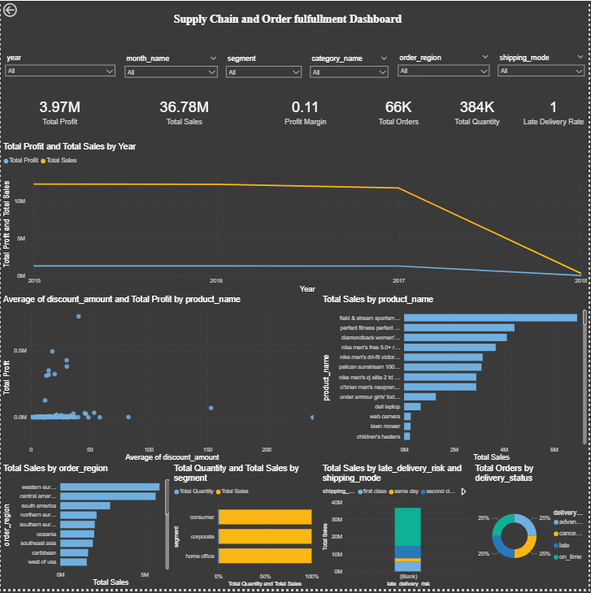
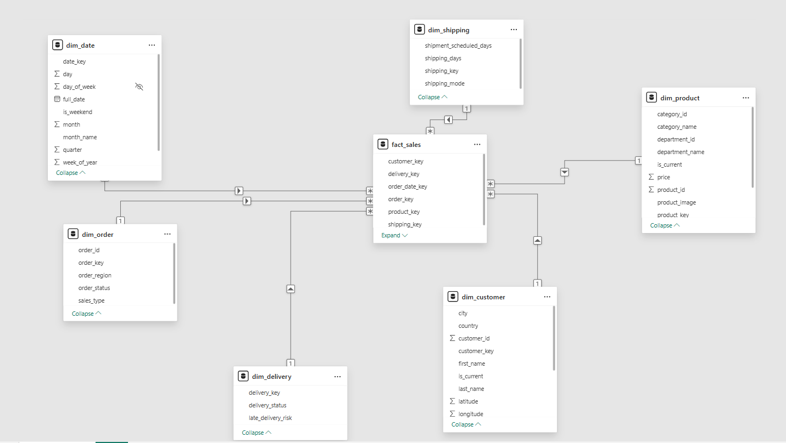
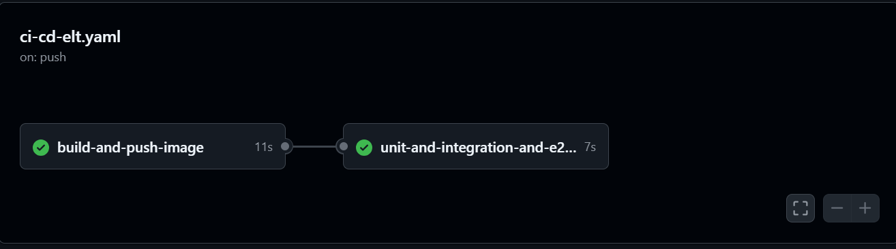
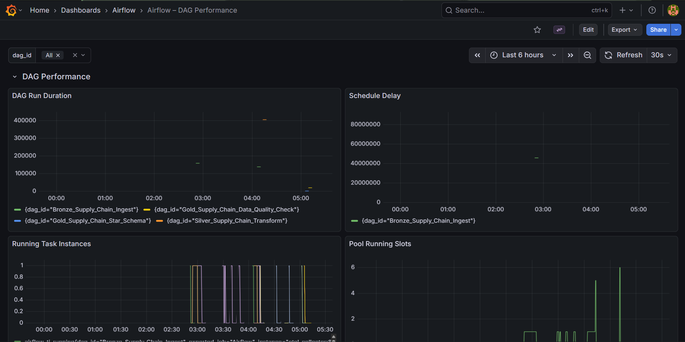
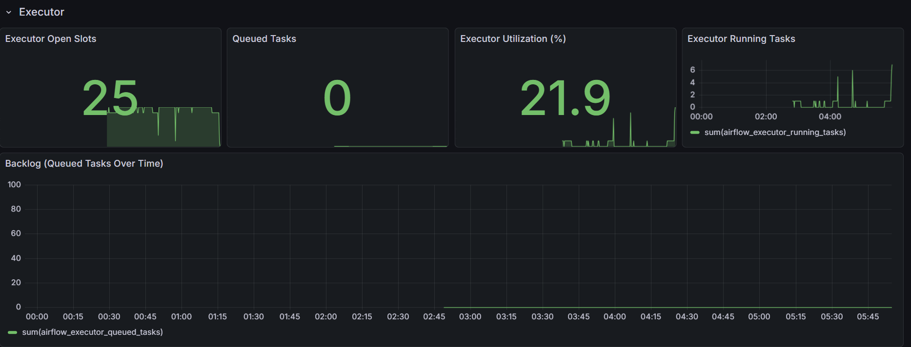
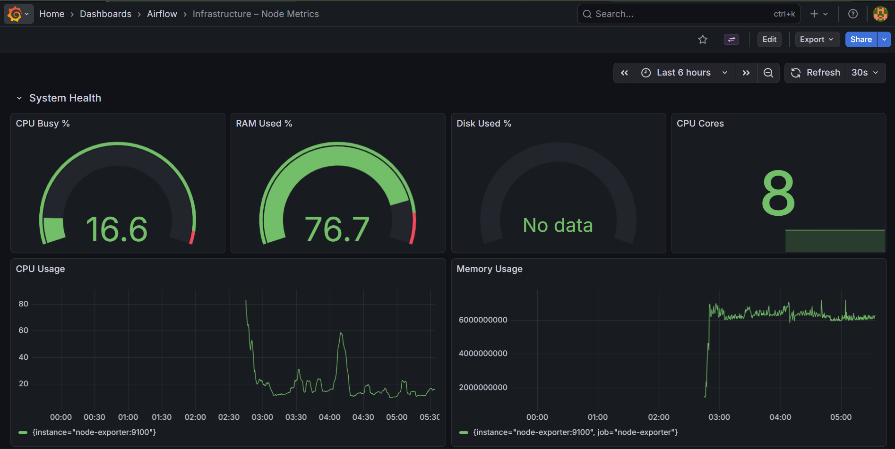
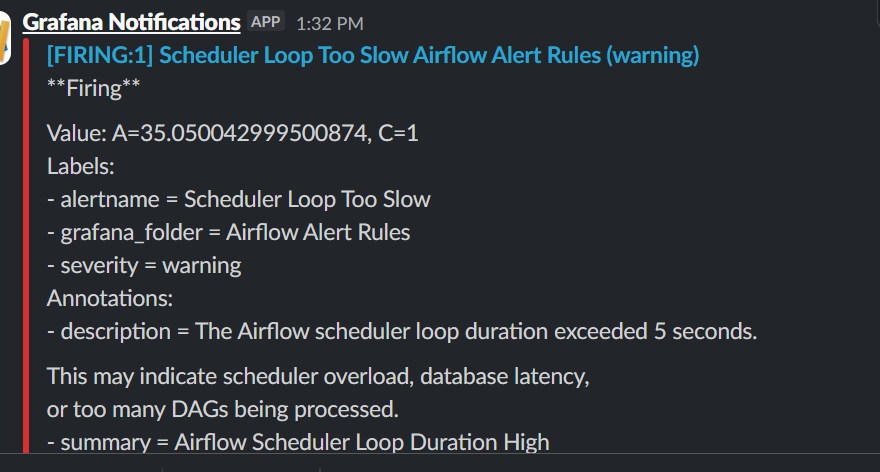

# 📦 Supply Chain and Ecommerce Orderfulment Pipeline

# Architecture Diagram

# 🛠️ Tech Stack

### Executive Summary

This project implements an end-to-end data engineering pipeline designed to improve order fulfilment visibility, sales performance analysis, and supply chain efficiency in an e-commerce environment.

By consolidating fragmented operational data (orders, shipments, deliveries, and customer activity) into a centralized cloud-based data platform, the solution enables:

- Near real-time visibility into order lifecycle and delivery performance
- Reliable, analytics-ready datasets through structured data modeling
- Faster decision-making via OLAP queries and BI dashboards

The platform transforms raw logistics data into a star-schema warehouse in Amazon Redshift, reducing reporting latency and enabling stakeholders to monitor key metrics such as:

Order volume and revenue trends
Profit margins and discount impact
Delivery performance (late delivery rate: 1%)
Product, customer, and regional performance

The pipeline processes ~18K orders per batch with an average runtime of 5–10 minutes, while enabling sub-second analytical queries in Amazon Redshift.

## Problem Definition

Supply Chain and Ecommerce operations generate large volumes of data from multiple systems, including orders, shipments, warehouse operations, delivery times and customer feedback.

However, this data is often fragmented, inconsistent and stored in different formats. As a result:

* Reporting is delayed
* Real-time visibility into order fulfilment is limited
* Data quality issues reduce trust in analytics
* Identifying supply chain bottlenecks becomes difficult
* Manual data handling increases operational risk

Without an integrated data pipeline and structured analytical model, transforming raw logistics data into reliable, decision-ready insights is challenging.

## Stakeholder Objectives
* **Sales Performance:** monitor and improve overall sales across products and regions.
* **Profitability:** Analyze profit margins to maximize business profitability.
* **Customer Insights:** Understand customer behavior to improve targeting and retention.
* **Logistics Efficiency:** Reduce late deliveries and improve shipping performance.
* **Regional Analysis:** Identify high-performing and underperforming sales regions.
* **Product Performance:** Evaluate product demand to optimize product offerings.
* **Discount Strategy:** Assess the impact of discounts on sales and profit.

# ✅ Solution
This project implements a **cloud-based data pipeline** and builds an **OLAP-ready data warehouse** to enable efficient logistics analytics.

The solution:

* Integrates data from multiple operational systems
* Cleans and standardizes data for quality and consistency
* Transforms raw data into a dimensional (star schema) model
* Enables fast, multidimensional OLAP analysis
* Supports data-driven decision-making through BI tools

The result is a scalable analytical system that improves visibility, performance monitoring, and strategic decision-making in e-commerce logistics.

### Key Insights

* Generated **$36.78M in sales** and **$3.97M profit** from **66K orders**, with an overall **11% profit margin**.
* **Sales and profit remained stable from 2015–2017**, followed by a **sharp decline in 2018**, indicating potential operational or data issues.
* **Sports and outdoor products** (e.g., tents, bikes, running shoes) are the **top revenue drivers**.
* The **Consumer segment contributes the highest share of sales**, highlighting a strong **B2C focus**.
* The supply chain is **highly efficient**, with a **late delivery rate of only 1%**.

### Operational and Business Outcomes

* **Improved Supply Chain Visibility:**  
  By centralizing fragmented logistics data into a unified Amazon Redshift warehouse, the pipeline enables end-to-end tracking of the order lifecycle (order → shipment → delivery), improving visibility across operations.

* **Reduced Reporting Latency:**  
  Transforming raw data into a structured star schema significantly reduces query time, enabling near real-time dashboard updates and faster decision-making.

* **Enhanced Data Quality and Trust:**  
  Standardized transformations in the Bronze–Silver–Gold pipeline reduce inconsistencies and missing data issues, increasing confidence in analytics outputs.

* **Improved Logistics Performance Monitoring:**  
  Aggregated delivery metrics (e.g., 1% late delivery rate) enable continuous monitoring of fulfilment SLAs and early detection of performance degradation.

* **Profit Optimization Enablement:**  
  Integrating sales and discount data into a single analytical model allows identification of margin erosion, supporting more effective pricing and discount strategies.

* **Scalable Analytics Foundation:**  
  The modular pipeline design (Airflow + S3 + Redshift) enables easy extension to additional data sources, supporting future growth and advanced analytics use cases.

# Data Warehouse Overview

The analytics layer is built using a **star schema** in Amazon Redshift, designed to support high-performance analytical queries.

At the core is the `fact_sales` table, which captures both:
- granular line-level transaction data
- aggregated order and delivery performance metrics

This is supported by conformed dimension tables:

- `dim_customer`
- `dim_product`
- `dim_date`
- `dim_order`
- `dim_shipping`
- `dim_delivery`

### Analytical Coverage

The schema enables multidimensional analysis across:

- **Who:** customer segments and locations  
- **What:** products and categories  
- **When:** order, shipping, and delivery timelines  
- **Where:** geographic performance  

This design supports **sub-second query performance** for BI dashboards and ad-hoc analysis.

## ⚙️ System Performance & Scale

- Processes ~18K orders and associated logistics records across historical datasets  
- Average pipeline (Airflow DAG) runtime: ~5–10 minutes per batch load  
- Data transformations handle multiple datasets across Bronze, Silver, and Gold layers with consistent schema enforcement  
- Analytical queries in Amazon Redshift achieve **sub-second response times** for dashboard workloads  
- Data is partitioned across Bronze–Silver–Gold layers to support scalable processing  

### Data Quality & Reliability
- Implemented schema validation and null handling during transformations  
- Airflow retry mechanisms and logging ensure pipeline robustness  
- CI/CD pipeline includes unit, integration and DAG-level tests  

## Assumptions & Constraints

### Assumptions
- Data represents a single e-commerce platform
- Pipeline operates on batch processing (no real-time streaming)
- Source data schemas remain relatively stable
- Delivery timestamps are accurate and complete

### Constraints
- No Change Data Capture (CDC) implemented
- Limited handling of late-arriving data
- No strict SLA guarantees for data freshness
- Simplified supply chain model (no multi-warehouse complexity)

# Technology Choices

# 1. Data Storage – Amazon S3 Data Lake

**Amazon S3** was used as the primary storage layer for the project.

Instead of multiple buckets, a **single S3 bucket was used with a layered folder structure** following the **Bronze–Silver–Gold data lake architecture**:

### Bronze Layer

Stores raw data exactly as ingested from the source system. No transformations are applied at this stage to preserve the original dataset.

### Silver Layer

Contains cleaned and standardized datasets after basic transformations such as:

* data type corrections
* handling missing values
* schema alignment

### Gold Layer

Stores curated and analytics-ready datasets that are optimized for reporting, dashboards and downstream consumption.

This layered structure helps maintain:

* **data lineage**
* **data quality management**
* clear separation between raw data and business-ready datasets.

In addition, a **separate S3 bucket was created for testing and development purposes**, allowing experimentation and validation of ETL processes without affecting production data.

# 2. Data Processing & ETL – Python, Pandas, PyArrow, Delta-rs

**Python** was used to implement the ETL (Extract, Transform, Load) pipeline.

The pipeline reads raw datasets from the **Bronze layer in Amazon S3**, performs a series of transformations and writes the processed data back to the **Silver and Gold layers**.

Key transformation steps include:

* Data cleaning
* Handling missing values
* Data type conversions
* Data enrichment and feature preparation

The implementation relies on several Python libraries:

* **Pandas** – for data manipulation and transformation
* **PyArrow** – for efficient columnar data processing and Parquet support
* **Delta-rs** – for managing Delta Lake tables and enabling reliable data versioning and ACID-compliant writes

Using Python with these libraries allows efficient processing of datasets while maintaining compatibility with modern **data lake table formats**.

# 3. Data Warehousing – Amazon Redshift

**Amazon Redshift** was used as the analytical data warehouse.

Data from the **processed S3 layer** is loaded into Redshift where it is structured into a **Star Schema** for analytical queries.

The warehouse includes:

### Fact Table

* `Fact_Sales`

### Dimension Tables

* `Dim_Customer`
* `Dim_Product`
* `Dim_Category`
* `Dim_Location`
* `Dim_Time`
* `Dim_Shipping`

This schema enables **fast analytical queries, aggregations, and reporting** for business intelligence.

# 4. Data Modeling – SQL

**SQL** was used to transform the warehouse data into **analytics-ready models** within Amazon Redshift.

Using SQL for transformations allowed the project to:

* Build **structured transformation logic** for cleaning and preparing data
* Implement the **Star Schema data model**, including fact and dimension tables
* Create reusable **SQL scripts** for loading and transforming data
* Ensure **data integrity and consistency** through validation queries

SQL was used to create the following warehouse models:

### Dimension Tables

* `dim_customer`
* `dim_product`
* `dim_date`
* `dim_order`
* `dim_shipping`
* `dim_delivery`

### Fact Table

* `fact_sales`

These SQL transformations convert the **Silver layer datasets** into a **Gold layer star schema** optimized for analytical queries and business intelligence tools such as **Power BI**.

# 5. Workflow Orchestration – Apache Airflow

**Apache Airflow** was used to orchestrate the data pipeline.

Airflow schedules and manages the workflow using **DAGs (Directed Acyclic Graphs)** that coordinate:

1. Data ingestion to S3
2. Data Transformation
3. Data loading into Redshift
4. Data quality checks

Airflow ensures tasks run in the correct order and provides monitoring for pipeline execution.

# 6. Business Intelligence & Visualization

A **dashboarding tool (Power BI)** was used to visualize insights from the Redshift warehouse.

The dashboard presents key business metrics including:

* Total Sales
* Profit Margins
* Customer Segments
* Regional Sales Performance
* Product Performance
* Delivery Performance

This allows stakeholders to monitor **sales trends, profitability, logistics performance, and customer insights in one unified dashboard.**

# 7. Version Control & Collaboration – GitHub

All project code including:

* Python scripts
* Airflow DAGs
* data models
* Infrastructure configuration

was stored in **GitHub**.

Using Git enables:

* Version tracking
* Team collaboration
* Code review
* Reproducible pipelines

# 8. Monitoring & Logging

Monitoring mechanisms were implemented to ensure pipeline reliability.

* **Airflow logs** track task execution and failures.
* Alerts can be configured to notify teams if pipeline steps fail.

This ensures quick troubleshooting and reliable data processing.

## GitHub Actions

* **`build-and-push-image`** – Builds a Docker image if the Dockerfile or requirements changed (or on manual trigger) and pushes it to Docker Hub.
* **`unit-and-integration-and-e2e-tests`** – Starts the Airflow stack, runs unit and DAG tests for changed DAGs, include files, or docker-compose.yaml, then tears down the stack.

## 10. Monitoring & Alerting

Prometheus scrapes Airflow, with Grafana dashboards visualizing system health.

### Airflow dag Dashboard

### Airflow cluster dashboard

### Operational management

### Slack Notifications

# Future Improvements

While the current pipeline is functional and production-ready, several improvements can further enhance scalability, maintainability and governance.

## Areas for Future Improvement

Several enhancements can further strengthen the platform:

* Implement **dbt for Transformations**
* Implement **data quality validation frameworks**
* Implement **Infrastructure as Code (Terraform)**
* Implement **data cataloging and metadata management**
* Introduce **cost monitoring for cloud resources**
* Implement **data security and access control policies**
